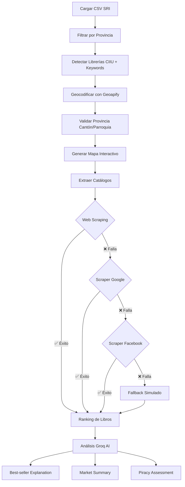

# 📚 Sistema de Análisis de Librerías por Provincia (Dataset SRI)

Un sistema inteligente con **scrapers integrados** que analiza datos del SRI para identificar, mapear y estudiar librerías por provincia, extrayendo catálogos de libros desde múltiples fuentes (web, DuckDuckGo, Facebook) con análisis de IA mediante Groq.

---

## 🎯 Características Principales

✨ **Análisis Completo de Librerías**
- Detección automática de librerías usando CIIU y análisis de nombres
- Filtrado estricto por provincia con validación geográfica
- Cálculo de métricas estadísticas detalladas

🗺️ **Visualización Geoespacial Precisa**
- Geocodificación con Geoapify usando cantón y parroquia
- Validación estricta: solo muestra librerías de la provincia seleccionada
- Mapas interactivos con Folium y marcadores detallados

📖 **Scraping Multi-Fuente de Catálogos**
- **Nivel 1:** Web scraping directo desde sitios oficiales
- **Nivel 2:** Scraper Google integrado (DuckDuckGo - sin API key)
- **Nivel 3:** Scraper Facebook con Selenium + Groq AI
- **Nivel 4:** Fallback con catálogo simulado realista
- Sistema en cascada: intenta cada fuente hasta obtener resultados

🤖 **Análisis con IA (Groq)**
- Explicaciones inteligentes sobre best-sellers
- Análisis de factores de mercado local
- Evaluación de riesgos de piratería
- Resúmenes automáticos del ecosistema editorial

---

## 📋 Requisitos Previos

### Sistema Operativo
- macOS, Linux o Windows
- Python 3.8 o superior

### Credenciales Necesarias
1. **API Key de Geoapify** - Para geocodificación
   - Obtén una en: [geoapify.com](https://www.geoapify.com/)
   - Créditos gratuitos disponibles

2. **API Key de Groq** - Para análisis con IA
   - Obtén una en: [console.groq.com](https://console.groq.com/)
   - Modelo usado: `llama-3.3-70b-versatile`

3. **Dataset SRI**
   - Archivo CSV con columnas requeridas:
     - `NOMBRE_FANTASIA_COMERCIAL`
     - `DESCRIPCION_PROVINCIA_EST`
     - `DESCRIPCION_CANTON_EST`
     - `DESCRIPCION_PARROQUIA_EST`
     - Otras columnas de ubicación (detectadas automáticamente)

---

## 🚀 Instalación y Configuración

### 1. Clonar el Repositorio
```bash
git clone https://github.com/tuusuario/completo.git
cd completo
```

### 2. Crear Entorno Virtual
```bash
python3 -m venv venv
source venv/bin/activate  # En macOS/Linux
# o para Windows: venv\Scripts\activate
```

### 3. Instalar Dependencias
```bash
pip install -r requirements.txt
```

**Dependencias principales:**
- `streamlit` - Interfaz web
- `pandas` - Procesamiento de datos
- `requests` + `beautifulsoup4` - Web scraping
- `folium` + `branca` - Mapas interactivos
- `groq` - Análisis con IA
- `selenium` + `webdriver-manager` - Scraping dinámico (Facebook)
- `unidecode` - Normalización de texto

### 4. Configurar Variables de Entorno (Opcional)

Las API Keys se pueden configurar de dos formas:

#### Opción A: Variables de Entorno (Recomendado)

**En macOS/Linux:**
```bash
export GEOAPIFY_KEY="tu_clave_aqui"
export GROQ_API_KEY="tu_clave_aqui"
streamlit run main.py
```

**En Windows (PowerShell):**
```powershell
$env:GEOAPIFY_KEY="tu_clave_aqui"
$env:GROQ_API_KEY="tu_clave_aqui"
streamlit run main.py
```

**En Windows (CMD):**
```cmd
set GEOAPIFY_KEY=tu_clave_aqui
set GROQ_API_KEY=tu_clave_aqui
streamlit run main.py
```

#### Opción B: Interfaz Web (Más flexible)
Si no configuras variables de entorno, la aplicación te pedirá las claves directamente en la interfaz cuando la ejecutes.

---

## 💻 Ejecución

### Iniciar la Aplicación Streamlit

En el terminal, desde la carpeta del proyecto:

```bash
streamlit run main.py
```

La aplicación se abrirá automáticamente en `http://localhost:8501`

**Nota:** Asegúrate de que tu entorno virtual (`venv`) esté activado antes de ejecutar el comando.

---

## 📖 Guía de Uso

### Paso 1: Cargar Dataset
1. Haz clic en **"Subir archivo CSV"**
2. Selecciona tu archivo CSV del SRI
3. El sistema detectará automáticamente el separador (`,`, `;`, `|`, etc.)

### Paso 2: Ingresar Credenciales
- **API Key de Geoapify**: Ingresa tu clave para geocodificación
- **API Key de Groq**: Ingresa tu clave para análisis de IA

### Paso 3: Seleccionar Provincia
1. Elige la provincia a analizar del dropdown
2. El sistema mostrará:
   - Cantidad de librerías detectadas
   - Cantones y parroquias con presencia

### Paso 4: Analizar Datos
La aplicación ejecutará automáticamente:
1. **Detección de librerías** - Identifica negocios del rubro
2. **Geocodificación** - Obtiene coordenadas precisas
3. **Estadísticas** - Calcula métricas de distribución
4. **Mapa interactivo** - Visualiza ubicaciones en tiempo real

### Paso 5: Extracción de Catálogos (Automático)
El sistema **extrae automáticamente** catálogos de libros intentando múltiples fuentes:

**Para cada librería detectada:**
1. ✅ **Web scraping directo** - Busca en Google y extrae del sitio oficial
2. ✅ **Scraper Google (DuckDuckGo)** - Búsqueda sin límites de API
3. ✅ **Scraper Facebook** - Extrae posts con títulos de libros usando Selenium + IA
4. ✅ **Fallback simulado** - Genera catálogo realista si fallan todas las fuentes

**Resultado:** Ranking de los 15 libros más repetidos entre todas las librerías.

### Paso 6: Análisis con IA (Groq)
El sistema genera automáticamente:
- 📖 **Explicación de best-sellers** - Por qué ciertos títulos dominan el mercado
- 📊 **Análisis de mercado local** - Factores económicos y culturales
- ⚠️ **Evaluación de piratería** - Riesgos por título y provincia
- 📝 **Resumen integral** - Insights sobre el ecosistema editorial

---

## 📁 Estructura del Proyecto

```
completo/
├── main.py                  # Aplicación principal Streamlit
├── data_processing.py       # Procesamiento de datos + web scraping
├── scraper_google.py        # Scraper DuckDuckGo integrado (sin API key)
├── scraper_facebook.py      # Scraper Facebook con Selenium + Groq AI
├── groq_handler.py          # Integración con API de Groq
├── mapping.py               # Generación de mapas interactivos
├── requirements.txt         # Dependencias del proyecto
├── .gitignore              # Archivos ignorados en git
├── cookies.json            # (Opcional) Cookies de Facebook para login
├── README.md               # Este archivo
├── COMMITS.md              # Guía de commits con gitmojis
└── QUICK_START.md          # Guía rápida de inicio
```

### Descripción de Módulos

#### `main.py`
- Interfaz web con Streamlit
- Orquestación del flujo completo de análisis
- Manejo de estado y sesiones
- Visualización de resultados

#### `data_processing.py`
- `load_and_clean_data()` - Carga y limpia CSV con detección automática de separador
- `filter_by_province()` - Filtrado con normalización de texto
- `detect_libraries()` - Detecta librerías por CIIU y palabras clave
- `geocode_one()` - Geocodifica con validación de provincia por cantón/parroquia
- `geocode_libraries()` - Geocodificación masiva con validación estricta
- `build_books_ranking_from_libraries()` - Ranking multi-fuente con cascada de scrapers

#### `scraper_google.py`
- `buscar_en_google()` - Búsqueda en DuckDuckGo (HTML, sin API)
- `clasificar_links()` - Filtra resultados a solo librerías
- `extraer_catalogo()` - Extrae títulos de libros de sitios web
- `buscar()` - Función principal que combina todo
- ⚡ **Funciona sin FastAPI** - Importable directamente

#### `scraper_facebook.py`
- `configurar_selenium()` - Setup de Chrome WebDriver
- `cargar_cookies()` - Mantiene sesión de Facebook
- `extraer_posts()` - Extrae posts de páginas de Facebook
- `detectar_titulos_batch()` - Usa Groq AI para identificar títulos de libros
- `extraer_libros_facebook()` - Función principal
- ⚡ **Funciona sin FastAPI** - Importable directamente

#### `groq_handler.py`
- `init_groq_client()` - Inicializa cliente Groq
- `explain_best_seller()` - Explica por qué un libro es popular
- `summarize_analysis()` - Genera resumen del mercado editorial
- Modelo: `llama-3.3-70b-versatile`

#### `mapping.py`
- `create_map_html()` - Genera mapas interactivos con Folium
- Validación doble de provincia (columna + geocodificación)
- Marcadores con información detallada

---

## 🔧 Configuración Avanzada

### Sistema de Scrapers en Cascada

El sistema intenta **4 niveles de extracción** para cada librería:

```python
# Nivel 1: Web scraping directo
google_search_first_result() + extraer_catalogo_web()

# Nivel 2: Scraper Google (DuckDuckGo)
from scraper_google import buscar
resultado = buscar(nombre, "Ecuador")

# Nivel 3: Scraper Facebook
from scraper_facebook import extraer_libros_facebook
resultado = extraer_libros_facebook(url, groq_key)

# Nivel 4: Fallback simulado
_generar_libros_fallback()  # Títulos realistas
```

### Variables de Sesión Streamlit
- `geoapify` - API Key de Geoapify
- `groq` - API Key de Groq
- `df` - DataFrame original cargado
- `filtered_df` - Filtrado por provincia
- `libraries_df` - Librerías detectadas
- `geocoded_df` - Con coordenadas validadas
- `map_html` - Mapa generado

### Parámetros Personalizables

**En `data_processing.py`:**
```python
# CIIUs de librerías
LIBRARY_CIIUS = ["G4761", "G4762", ...]

# Palabras clave
LIBRARY_KEYWORDS = ["librer", "book", "editorial", ...]

# Libros de fallback
LIBROS_FALLBACK = ["El Quijote", "Cien años de soledad", ...]
```

**En `scraper_google.py`:**
```python
# Excluir papelerías
EXCLUIR = ["papeler", "utiles", "escolar", ...]

# Incluir solo libros
INCLUIR = ["libr", "book", "editorial", ...]
```

**En `scraper_facebook.py`:**
```python
# Configuración Selenium
cantidad_posts = 10  # Posts a extraer
tiempo_scroll = 30   # Segundos de scroll
```

---

## 📊 Salidas y Resultados

### Tablas de Datos
- **Librerías detectadas** - Nombre, ubicación, CIIU
- **Estadísticas por cantón/parroquia** - Distribución geográfica
- **Ranking de libros** - Títulos más repetidos

### Visualizaciones
- **Mapa interactivo** - Ubicación de todas las librerías
- **Gráficos estadísticos** - Distribución por zona

### Análisis de IA
- **Explicación de best-sellers** - Por qué ciertos libros lideran
- **Resumen de mercado** - Tendencias y patrones
- **Evaluación de piratería** - Riesgos por título

---

## 🐛 Troubleshooting

### Error: "Invalid API Key"
**Solución:**
- Verifica tu clave en [console.groq.com](https://console.groq.com/) o [geoapify.com](https://www.geoapify.com/)
- Elimina espacios en blanco al copiar/pegar
- Asegúrate de usar las variables correctas: `GEOAPIFY_API_KEY` y `GROQ_API_KEY`

### Error: "Could not geocode address"
**Solución:**
- Verifica créditos en tu cuenta de Geoapify
- El sistema valida por cantón/parroquia - algunas direcciones pueden fallar
- Los resultados fuera de provincia se filtran automáticamente

### Scraper Google no funciona
**Solución:**
- Verifica conexión a internet
- DuckDuckGo puede bloquear temporalmente por exceso de requests
- Espera 1-2 minutos y reintenta
- El sistema tiene fallback automático

### Scraper Facebook no extrae posts
**Solución:**
- Necesitas `cookies.json` con sesión activa de Facebook
- Instala dependencias: `pip install selenium webdriver-manager`
- Chrome debe estar instalado en el sistema
- Si falla, el sistema usa fallback automáticamente

### Aplicación lenta
**Causas normales:**
- Web scraping toma 1-2 segundos por librería
- Geocodificación con validación es más lenta pero precisa
- Groq AI puede tardar 2-5 segundos por análisis

**Optimizaciones:**
- Reduce `max_librerias` en el código (default: 5)
- Usa datasets filtrados previamente
- El caché de Streamlit ya está activo

### CSV no se carga
**Solución:**
- Verifica formato válido (sin filas corruptas)
- Columnas requeridas: `NOMBRE_FANTASIA_COMERCIAL`, `DESCRIPCION_PROVINCIA_EST`
- El sistema detecta separador automáticamente (`,`, `;`, `|`, `\t`)
- Prueba con encoding UTF-8

### Mapa no muestra todas las librerías
**Es intencional:**
- El sistema **valida estrictamente** por provincia
- Solo muestra librerías cuyas coordenadas estén dentro de la provincia seleccionada
- Geoapify puede devolver resultados de otras provincias - se filtran automáticamente

---

## 🚢 Despliegue

### En Streamlit Cloud (Gratuito)
```bash
# 1. Pushea a GitHub
git push origin main

# 2. Ve a https://streamlit.io/cloud
# 3. Conecta tu repositorio
# 4. Crea un secreto con tus API Keys en los settings
```

### En Servidor Personal
```bash
# Instala supervisor o similar para mantener el proceso vivo
pip install gunicorn
streamlit run main.py --server.port 8501 &
```

---

## 📝 Dependencias

| Librería | Versión | Uso |
|----------|---------|-----|
| streamlit | latest | Framework web interactivo |
| pandas | latest | Procesamiento y análisis de datos |
| requests | latest | HTTP requests para APIs y scraping |
| beautifulsoup4 | latest | Parsing HTML para web scraping |
| folium | latest | Mapas interactivos con Leaflet |
| branca | latest | Soporte visual de mapas |
| groq | latest | API de IA (LLaMA 3.3 70B) |
| selenium | latest | Automatización de navegador |
| webdriver-manager | latest | Gestión automática de drivers |
| unidecode | latest | Normalización de texto |

**Instalación completa:**
```bash
pip install streamlit pandas requests beautifulsoup4 folium branca groq selenium webdriver-manager unidecode
```

---

## 🤝 Contribuciones

Las contribuciones son bienvenidas. Por favor:
1. Fork el repositorio
2. Crea una rama (`git checkout -b feature/mejora`)
3. Commit tus cambios (`git commit -m 'Añade mejora'`)
4. Push a la rama (`git push origin feature/mejora`)
5. Abre un Pull Request

---


## 📞 Contacto y Soporte

Si encuentras problemas:
- Abre un issue en GitHub
- Revisa la sección de Troubleshooting
- Consulta la documentación de las APIs externas

---

## 🎓 Casos de Uso

✅ **Análisis de mercado editorial** - Estudia distribución y tendencias por provincia
✅ **Investigación académica** - Dataset del SRI + análisis geoespacial
✅ **Detección de oportunidades** - Identifica zonas con baja cobertura
✅ **Estudio de piratería** - Evalúa riesgos por título y región
✅ **Expansión comercial** - Planifica apertura de nuevas librerías
✅ **Benchmarking competitivo** - Compara catálogos entre competidores
✅ **Análisis cultural** - Estudia patrones de lectura por región

---

## 🔄 Flujo Completo del Sistema



---

## 🚀 Roadmap Futuro

- [ ] Integración con más fuentes de datos (Mercado Libre, Amazon)
- [ ] Dashboard de métricas en tiempo real
- [ ] Exportación de reportes en PDF
- [ ] API REST para consultas programáticas
- [ ] Sistema de alertas por cambios en el mercado
- [ ] Análisis predictivo de tendencias

---

**Última actualización:** 10 de Diciembre de 2025

¡Disfruta analizando el mercado de librerías ecuatoriano! 📚🇪🇨✨
